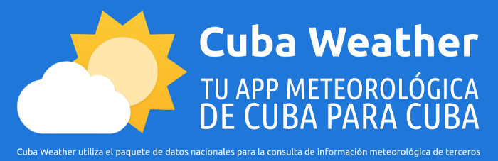

# Cuba Weather - De Cuba Para Cuba

> Leynier Gutiérrez González | October 24, 2020

Cuba Weather es un proyecto pionero en Cuba de código abierto, multiplataforma y sin ánimo de lucro, cuyo objetivo es brindar a los residentes en Cuba una manera cómoda de acceder a información meteorológica obtenida de fuentes nacionales utilizando solo navegación nacional (por ejemplo, el bono de 300 megabytes nacionales de los paquetes de datos). A poco más de un mes de subida en Apklis ha alcanzado más de 27 mil descargas, varios reportes en medios digitales, una gran contribución de los usuarios mediante sugerencias y donaciones, colaboración y asesoramiento de especialistas del INSMET y mejoras implementadas por varios desarrolladores creando en poco tiempo una comunidad entusiasta alrededor del proyecto.

El proyecto es de código fuente abierto, pues es objetivo de sus creadores fomentar el software libre y el código abierto en Cuba. Todos los códigos relacionados con el proyecto se encuentran en GitHub bajo la organización Cuba Weather (<https://github.com/cuba-weather>).

Para el desarrollo de la aplicación Android se utilizó Flutter (SDK de código fuente abierto de desarrollo de aplicaciones móviles creado por Google. Suele usarse para desarrollar interfaces de usuario para aplicaciones en Android, iOS y Web, así como método primario para crear aplicaciones para Google Fuchsia).

Solo se utiliza información meteorológica extraída de fuentes nacionales, por lo que no es necesario de navegación internacional, ampliando la gama de opciones disponibles de la navegación nacional diferenciándose de otras aplicaciones y contribuyendo con la informatización del país.

En la versión actual de la aplicación se obtienen los datos del sitio web oficial del Instituto de Meteorología de Cuba (<http://www.insmet.cu>), del cual se obtienen los pronósticos extendidos del día actual y del siguiente, las perspectivas del tiempo y los pronósticos para varios días en adelante. Además, se utiliza información extraída del buscador cubano RedCuba (<https://www.redcuba.cu>) como la temperatura, la humedad, la presión atmosférica y la velocidad y dirección del viento con un periodo de actualización de 2 a 3 horas.

Ha contado con una gran colaboración de parte de reconocidos meteorólogos como Elier Pila, de la comunidad de desarrolladores de Cuba y de los usuarios, quienes han contribuido de diversas formas, entre ellas, donaciones. Estas donaciones son utilizadas para pagar infraestructura como el dominio (<https://cubaweather.app>), un hosting de Etecsa para la versión web del proyecto, licencias de desarrollador para las principales tiendas (Google Play y Apple Store). En ningún caso, estas son utilizadas para beneficio propio de alguno de sus desarrolladores.

Actualmente está disponible una aplicación para Android publicada en Apklis (<https://www.apklis.cu/application/com.codestrange.www.cuba_weather>).
