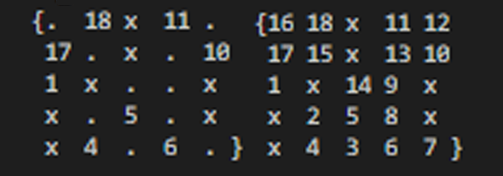
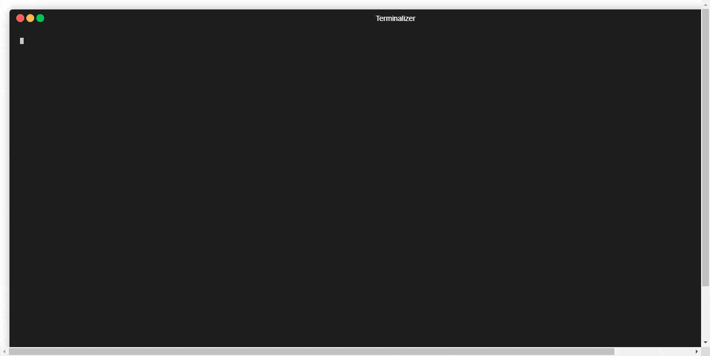

# Hidato - Haskell

> [Carlos Bermudez Porto](https://www.linkedin.com/in/carlos-bermudez-porto-3078bb165) y Leynier Gutiérrez Gonzáles | October 25, 2020


> [Repositorio de GitHub](https://github.com/codestrange/declarative-programing-hidato-project)

## Significado de Haskell

**Haskell** es un [lenguaje de programación](https://es.wikipedia.org/wiki/Lenguaje_de_programaci%C3%B3n) estandarizado multi-propósito, [funcionalmente puro](https://es.wikipedia.org/wiki/Programaci%C3%B3n_funcional), con [evaluación no estricta y memorizada](https://es.wikipedia.org/wiki/Evaluaci%C3%B3n_perezosa), y [fuerte tipificación](https://es.wikipedia.org/wiki/Fuertemente_tipado) estática. Su nombre se debe al lógico estadounidense [Haskell Curry](https://es.wikipedia.org/wiki/Haskell_Curry), debido a su aportación al [cálculo lambda](https://es.wikipedia.org/wiki/C%C3%A1lculo_lambda), el cual tiene gran influencia en el lenguaje. En Haskell, "una función es un ciudadano de primera clase" del lenguaje de programación. Como lenguaje de programación funcional, el constructor de controles primario es la función. El lenguaje tiene sus orígenes en las observaciones de Haskell Curry y sus descendientes intelectuales. [[1]](https://es.wikipedia.org/wiki/Haskell)

## Significado de Hidato

**Hidato** es un [juego](https://es.wikipedia.org/wiki/Juego) de [lógica](https://es.wikipedia.org/wiki/L%C3%B3gica) creado por el Dr. Gyora Benedek, un matemático israelí. El objetivo de Hidato es rellenar el tablero con [números consecutivos](https://es.wikipedia.org/w/index.php?title=N%C3%BAmeros_consecutivos&action=edit&redlink=1) que se conectan horizontal, vertical o diagonalmente. Los puzzles **Numbrix**, creados por [Marilyn Vos Savant](https://es.wikipedia.org/w/index.php?title=Marilyn_Vos_Savant&action=edit&redlink=1), son similares a Hidato excepto por los movimientos diagonales, que no están permitidos. Los nombres Numbrix e Hidato son marcas registradas. [[2]](https://es.wikipedia.org/wiki/Hidato)

## Explicación del Hidato

En el **Hidato**, el objetivo es rellenar el tablero con **números consecutivos** que **se conectan horizontal, vertical o diagonalmente**. En cada juego de Hidato, **los números mayor y menor están marcados** en el tablero. Todos los números consecutivos están adyacentes de forma vertical, horizontal o diagonal. Hay algunos números más en el tablero para ayudar a dirigir al jugador sobre cómo empezar a resolverlo y para asegurarse de que ese Hidato tiene solución única. Se suele jugar en una cuadrícula como Sudoku pero también existen tableros hexagonales u otros más irregulares con figuras como corazones, calaveras, etc. Cada puzzle de Hidato creado correctamente debe tener solución única.


> Un puzzle Hidato y su solución

## Modelación del Hidato

Para representar el tablero del juego Hidato se utilizó una tupla de 3 elementos `(nRows, nCols, setCells)`. En lo adelante, cuando se haga referencia a un tablero de Hidato se hará referencia a la tupla `(nRows, nCols, setCells)`.

**nRows:** `x ∈ Ν`. Representa la cantidad de filas del tablero

**nCols:** `x ∈ Ν`. Representa la cantidad de columnas del tablero

**setCells:** El conjunto `S` de todos los vectores `〈x, y, v〉` donde `x, y ∈ Ν, 1 ≤ x ≤ nRows, 1 ≤ y ≤ nCols, v ∈ Ζ, -1 ≤ v, ∀ 〈x1, y1〉 ∈ ([1, nRows]×[1, nCols]) ∩ Z x Z` el conjunto `S` contiene un único vector `〈x2, y2, v2〉` tal que `x1 = x2` y `y1 = y2`, no existen `2` vectores `〈x1, y1, v1〉 ∈ S y 〈x2, y2, v2〉 ∈ S tal que x1 ≠ x2, y1 ≠ y2, v1 > 0, v2 > 0 y v1 = v2; y v ≤ nRows * nCols - |{〈x1, y1, v1〉 | 〈x1, y1, v1〉 ∈ S ∧ v1 = -1}|`. Conjunto de vectores donde cada uno representa una celda en el tablero. La primera y segunda componente del vector representan la fila y columna respectivamente en la que se encuentra la celda dentro del tablero y la tercera componente representa el valor de la celda en el tablero. Estos valores son todos mayores iguales a `-1` y representan lo siguiente:

* `-1` representa un obstáculo, esa celda no se utiliza para el juego, de esta manera se pueden representar juegos de Hidato de la forma que se quiera utilizando obstáculos *(Externamente para el usuario se representa con `'x'`)*
* `0` Representa una celda en blanco, la cual debe ser rellenada para solucionar el Hidato *(Externamente para el usuario se representa con `'.'`)*
* Mayor que `0` representa una celda con un número rellenado ya sea porque estaba así en un inicio o porque fue rellenado durante el proceso de resolución del Hidato.

> Ejemplo visual de un tablero de Hidato


> Plantilla de Hidato válida de 5x5 e Hidato resuelto de 5x5

Se define como una **plantilla de Hidato** a un tablero donde `setCells` no contenga vectores con valores mayores que `1` en su tercera componente.

Se define como una **plantilla de Hidato válida** a una **plantilla de Hidato** si partiendo desde ella y realizando transformaciones válidas al conjunto setCells es posible llegar a un **Hidato resuelto**.

Las transformaciones válidas son aquellas que a partir de un tablero de Hidato se escoge un vector del conjunto `setCells` tal que su **tercera componente** sea **igual** a `0` y se modifica esa componente colocando un valor diferente de `0` siempre y cuando el resultado sea un tablero de Hidato.

Se define que `2` vectores `〈x1, y1, v1〉` y `〈x2, y2, v2〉`  del conjunto `setCells` de un tablero de Hidato son **adyacentes** si existe `〈x3, y3〉 ∈ ([-1, 1]×[-1, 1]) ∩ Z x Z - {〈0, 0〉}` tal que `〈x1, y1〉=〈x2, y2〉+〈x3, y3〉`.

Se define como un **Hidato resuelto** a un tablero de Hidato que no contenga vectores en `setCells` con la tercera componente igual a `0` y que `∀ 〈x1, y1, v1〉 ∈ setCells` con `v1 > 1` existe un vector `〈x2, y2, v2〉 ∈ setCells` que es adyacente con `〈x1, y1, v1〉` donde `v1 = v2 + 1`.

## Algoritmo de Solución

La idea general del algoritmo de solución es utilizar un recorrido por el grafo de posibles transformaciones válidas utilizando el algoritmo de búsqueda en profundidad o mejor conocido como DFS.

La función **solve** recibe un tablero, un paso y un límite (este límite es igual al mayor número posible dentro del tablero o sea el mayor v) y realiza lo siguiente:

* Si el paso es igual al límite más uno es que el tablero está rellenado completo y por tanto se resolvió completamente, por lo que devuelve una lista conteniendo al tablero.
* Si no, devuelve una lista resultante de concatenar las listas de tableros resultantes del proceso de utilizar cada tablero generado por la invocación de la función **stepMatrix** pasándole los argumentos del tablero actual y el paso actual como argumento de un llamado recursivo a la función **solve** con el paso siguiente y el mismo límite.

La función **stepMatrix** recibe un tablero y un paso y realiza lo siguiente:

* Si hay alguna celda con el valor igual al paso actual dentro del tablero actual y bien ese valor es 1 o la celda es adyacente con la celda que tiene el valor del paso anterior dentro del tablero actual devuelve una lista conteniendo al tablero actual.
* Si hay alguna celda con el valor igual al paso actual dentro del tablero actual y el valor NO es 1 y la celda NO es adyacente con la celda que tiene el valor del paso anterior dentro del tablero actual devuelve una lista vacía.
* Si no, devuelve una lista que contiene a los tableros resultantes del proceso de recorrer cada celda adyacente (que su valor sea diferente de 0) de la celda que tiene el valor del paso anterior dentro del tablero generando por cada una de estas celdas adyacentes un nuevo tablero con el valor de esa celda igual al paso actual.

> Ejemplo de pseudo implementación en Python del algoritmo de solución.

```python
def solve(table, step, limit):
    if step == limit + 1:
        return [table]
    else:
        return [
            item
            for new_table in step_matrix(table, step)
            for item in solve(new_table, step + 1, limit)
        ]

def step_matrix(table, step):
    if cell_in_table(step, table):
        if get_cell_value(get_cell(table, step)) == 1 or is_adyacents(get_cell(table, step), get_cell(table, step - 1)):
            return [table]
        else:
            return []
    else:
        return [
            update_cell_in_table(table, update_value_in_cell(step, cell))
            for cell in get_adyacents(table, get_cell(table, step - 1))
            if get_cell_value(cell) == 0
        ]
```

## Algoritmo de Generación

La idea general del algoritmo de generación es generar una plantilla de Hidato válida aleatoriamente a partir de una cantidad de filas, de columnas y de un porcentaje de obstáculos, resolver esta plantilla para obtener un Hidato resuelto y luego realizar un proceso de eliminación de una cantidad de celdas (según la dificultad seleccionada) cuyos valores sean mayores que 1 y menores que el máximo v en un orden aleatorio comprobando en cada paso que al eliminar no sea posible generar más de un Hidato resuelto (siendo el único posible, el Hidato resuelto desde donde se comenzó el proceso de eliminación).

* La función **generate** recibe el número de filas, de columnas, el porcentaje de obstáculos y la dificultad y realiza lo siguiente: Utilizando la función **generateHidatoSolved** genera un Hidato resuelto que utiliza como argumento al llamar a la función removeCells pasándole además como argumento a esta una permutación aleatoria de las casillas del Hidato resuelto (generado por la función **generateHidatoSolved**) que se pueden eliminar (aquellas que el valor sea mayor que 1 y menor que el máximo valor) y el número de casillas que se puede eliminar según la dificultad devolviendo finalmente la plantilla de Hidato.
* La función **generateHidatoSolved** recibe el número de filas, de columnas y el porcentaje de obstáculos y realiza lo siguiente: Comprueba si la pseudo plantilla de Hidato generada aleatoriamente por la función **generateRandomPseudoTemplate** es una plantilla de Hidato válida (que es posible a partir de ella llegar a un Hidato resuelto), si lo es, devuelve esa plantilla, si no, lo intenta nuevamente.
* La función **generateRandomPseudoTemplate** recibe el número de filas, de columnas y el porcentaje de obstáculos y realiza lo siguiente: Devuelve una pseudo plantilla (plantilla que no se ha comprobado que sea una plantilla de Hidato válida) con la cantidad de filas y columnas recibida como argumentos y con una cantidad de casillas (según el porcentaje de obstáculos) marcadas como obstáculos aleatoriamente.
* La función **removeCells** recibe una plantilla, una permutación aleatoria de las casillas que se pueden eliminar y el número de casillas que se deben eliminar según la dificultad y realiza lo siguiente: Si la permutación aleatoria de las casillas que se pueden eliminar es vacía o el número de casillas que se debe eliminar según la dificultad es negativo se devuelve la plantilla si no se genera una nueva plantilla modificando el valor (poniéndolo en 0) de la casilla correspondiente (según la permutación aleatoria de las casillas) a partir de la plantilla recibida como argumento, con esta nueva plantilla comprueba si se generan más de un Hidato resuelto, en caso de ser así devuelve el resultado de aplicar un llamado recursivo a **removeCells** pasándole la plantilla recibida como argumento, la cola de la permutación aleatoria de las casillas que se pueden eliminar y el mismo número de casillas que se deben eliminar (pues en ese paso no es posible eliminar la casilla porque genera más de un Hidato resuelto), en caso de generar solamente un Hidato resuelto devuelve el resultado de aplicar un llamado recursivo a **removeCells** pasándole la nueva plantilla, la cola de la permutación aleatoria de las casillas que se pueden eliminar y un número menos de casillas que se deben eliminar (pues en ese paso es posible eliminar la casilla porque genera solamente un Hidato resuelto).

> Ejemplo de pseudo implementación en Python del algoritmo de generación.

```python
def generate(n_rows, n_cols, ratio, diff):
    hidato_solved = generate_hidato_solved(n_rows, n_cols, ratio)
    max_elem = n_rows * n_cols - count_obstacles(hidato_solved)
    cells_for_remove = random_shuffle(filter(lambda cell: get_cell_value(cell) > 1 and get_cell_value(cell) < max_elem, get_cells(hidato_solved)))
    cant_empty = floor(len(cells_for_remove) * diff)
    template = remove_cells(hidato_solved, n_rows, n_cols, cells_for_remove, cant_empty)
    return template


def generate_hidato_solved(n_rows, n_cols, ratio):
    pseudo_template = generate_random_pseudo_template(n_rows, n_cols, ratio)
    limit = n_rows * n_cols - count_obstacles(pseudo_template)
    solves = solve(pseudo_template, 0, limit)
    if solves:
        return solves[0]
    else:
        return generate_hidato_solved(n_rows, n_cols, ratio)


def generate_random_pseudo_template(n_rows, n_cols, ratio):
    cant_obs = floor(n_rows * n_cols * ratio)
    blank_template = create_black_template(n_rows, n_cols)
    cells_for_remove = take(cant_obs, random_shuffle(get_cells(blank_template)))
    dark_template = reduce(lambda acc, cell: update_cell_in_table(acc, update_value_in_cell(-1, cell)), cells_for_remove, blank_template)
    pseudo_template = update_cell_in_table(dark_template, update_value_in_cell(1, select_random_cell(dark_template)))
    return pseudo_template


def remove_cells(template, n_rows, n_cols, cells_for_remove, cant_empty):
    if not cells_for_remove or cant_empty < 0:
        return template
    else:
        head_cell = cells_for_remove[0]
        tail_cells = cells_for_remove[1:]
        empty = update_value_in_cell(0, head_cell)
        new_template = update_cell_in_table(template, empty)
        limit = n_rows * n_cols - count_obstacles(new_template)
        solves = solve(new_template, 0, limit)
        if len(take(2, solves)) < 2:
            return remove_cells(new_template, n_rows, n_cols, tail_cells, cant_empty - 1)
        else:
            return remove_cells(template, n_rows, n_cols, tail_cells, cant_empty)
```

## Implementación en Haskell

Para la implementación en Haskell se utilizaron cuatro estructuras fundamentales, dos implementadas por defecto en Haskell y dos implementadas por los autores.

```haskell
import Data.Map (Map)
import qualified Data.Map as Map
import Data.Set (Set, lookupMin, lookupMax)
import qualified Data.Set as Set

data Cell = Cell { row :: Int, column :: Int, value :: Int }
data Matrix = Matrix { rows :: Int, columns :: Int, matrix :: Set Cell }
```

### Solucionador

La "cara pública" del solucionador es la función **solveAll** la cual mediante la característica llamada currying de Haskell que permite una aplicación parcial de una función, en este caso la función **solveAll** realiza una aplicación parcial de la función **solveRecursiveDFS** convirtiéndose la función **solveAll** en una función que recibe dos argumentos, una Matrix y una lista de enteros.

```haskell
solveAll :: Matrix -> [Int] -> [Matrix]
solveAll m = solveRecursiveDFS m 1 (Cell 0 0 0) (rows m * columns m  - countObstacles m) (buildMap m)
```

En el llamado a la función **solveRecursiveDFS** se utilizan dos funciones **countObstacles** y **buildMap**.

La función **countObstacles** calcula la cantidad de celdas con valor igual a `-1` auxiliándose de la función **countInMatrix** que permite contar la cantidad de celdas con valor igual a un número dado. Esta función se utiliza para contar la cantidad de casillas que no son obstáculos.

```haskell
countInMatrix :: Int -> Matrix -> Int
countInMatrix val (Matrix _ _ cells) =
                    foldl (\acc cell -> if value cell == val then acc + 1 else acc) 0 cells

countObstacles :: Matrix -> Int
countObstacles = countInMatrix (-1)
```

La función **buildMap** genera un mapa o diccionario a partir de las celdas de una matriz, utilizando como llaves los valores de las celdas y como valores las celdas. Este diccionario es utilizado posteriormente para saber si una casilla con un valor determinado se encuentra en el tablero y de ser así acceder a ella eficientemente.

```haskell
buildMap :: Matrix -> Map Int Cell
buildMap ma@(Matrix r c m) = Set.foldl (\acc cell -> Map.insert (value cell) cell acc) Map.empty m
```

La función **solveRecursiveDFS** recibe 6 argumentos.

1. **actualMatrix**: En la matriz actual, representando una plantilla de Hidato válida con posibilidades de ser un Hidato resuelto.
2. **step**: Es el paso del algoritmo y representa el número que se está intentando rellenar, pero puede existir ya en el tablero.
3. **prevCell**: Es la celda que tiene el valor (step `-1`), ya sea porque estaba en el tablero o porque se rellenó, este variable tiene el objetivo de disminuir la complejidad temporal del algoritmo evitando tener que realizar el procesamiento para obtener en cada paso.
4. **obs**: Es el número de casillas que NO son obstáculos.
5. **map**: Es un diccionario de entero contra celdas, en la explicación sobre la función buildMap se puede leer más sobre su objetivo.
6. **seeds**: Una lista de enteros infinita, su objetivo es ser utilizada como semilla para generar número pseudo aleatorios utilizados en el proceso de recorrer las casillas adyacentes haciendo en cada paso del algoritmo en un orden no necesariamente igual.

La función lo que hace es comprobar si se está en el último paso (que ya se rellenaron todas las casillas posibles y se llegó a un Hidato resuelto) o por lo contrario realizar los llamados recursivos buscando las posibles soluciones. (La explicación del algoritmo se encuentra en la sección Algoritmo de Solución).

```haskell
solveRecursiveDFS :: Matrix -> Int -> Cell -> Int -> Map Int Cell -> [Int] -> [Matrix]
solveRecursiveDFS actualMatrix step prevCell obs map seeds
      | step == obs + 1 = [actualMatrix]
      | otherwise = let toAdd = stepMatrix step actualMatrix prevCell map seeds
                    in concat [ solveRecursiveDFS matrix (step + 1) prevCell obs map (tail seeds) | (matrix, prevCell) <- toAdd ]
```

La función **stepMatrix** calcula las posibles matrices o plantillas de Hidato válidas partiendo de una plantilla recibida como argumento y el número que tiene que rellenar en la matriz. Esto lo hace utilizando prevCell y map para mejorar la complejidad temporal y realizar menos cálculos además de la utilización de otras funciones como **getAdjacents** e **isAdjacent**.

```haskell
stepMatrix :: Int -> Matrix -> Cell -> Map Int Cell -> [Int] -> [(Matrix, Cell)]
stepMatrix step m@(Matrix rs cs ma) prevCell map seeds = if Map.notMember step map
      then [
            newMatrix | cell <- getAdjacents prevCell rs cs step seeds,
            let actCell = Set.elemAt (Set.findIndex cell ma) ma,
            value actCell == 0,
            let newMatrix = (Matrix rs cs (Set.insert cell ma), cell)
      ]
      else  let actCell = map Map.! step
            in [newMatrix | isAdjacent actCell prevCell || value actCell == 1, let newMatrix = (m, actCell)]

getAdjacents :: Cell -> Int -> Int -> Int -> [Int] -> [Cell]
getAdjacents (Cell r c v) rs cs s seeds = [
        Cell nr nc s |
        dr <- genShuffle seeds [-1, 0, 1],
        dc <- genShuffle seeds [-1, 0, 1],
        let (nr, nc) = (r + dr, c + dc),
        nr > 0,
        nr <= rs,
        nc > 0,
        nc <= cs,
        not $ dr == 0 && dc == 0
    ]

isAdjacent :: Cell -> Cell -> Bool
isAdjacent (Cell f1 c1 v1) (Cell f2 c2 v2)
            | Cell f1 c1 v1 == Cell f2 c2 v2           = False
            | abs (f1 - f2) >= 2 || abs (c1 - c2) >= 2 = False
            | v1 == (-1) || v2 == (-1)                 = False
            | otherwise                                = True
```

### Generador

La "cara pública" del generador es la función **generateGame**, esta recibe la cantidad de filas y columnas, el porcentaje de obstáculos, la dificultad y un límite de tiempo que tendrá en generador para generar la plantilla de Hidato válida (más adelante se explicará con más detalles este límite de tiempo y porque es necesario). La función devuelve una tupla, en la primera componente significa si se puedo generar la plantilla y en la segunda componente la plantilla generada (notar que si la primera componente es igual a `False`, el valor de la segunda componente no tiene significado).

```haskell
generateGame :: Int -> Int -> Float -> Difficulty -> Int -> IO (Bool, Matrix)
generateGame rn cn ratio dif to = do
      maybeMatrix <- timeout to $ generateRandomGame rn cn ratio
      if isNothing maybeMatrix then do
            return (False, blankMatrix 1 1)
      else do
            let solution = maybe (blankMatrix rn cn) id maybeMatrix
            let maxElem = rn * cn - countObstacles solution
            let setForRemove = Set.filter (\x -> let v = value x in v > 1 && v < maxElem) (matrix solution) :: Set Cell
            randomCells <- genRCellFromSet setForRemove
            let total = Set.size setForRemove
            let cant_empty = floor $ fromIntegral total * emptyRatio dif
            seed <- randomIO :: IO Int
            let gen = mkStdGen seed
            let seeds = randoms gen :: [Int]
            let game = removeCells solution randomCells cant_empty seeds
            return (True, game)
```

La función generateGame se auxilia de la función **generateRandomGame** para obtener un Hidato resuelto. Para realizar esta operación se utiliza un tiempo límite, debido a la naturaleza aleatoria de **generateRandomGame** (no se asegura que termine, porque puede dependiendo de los parámetros demorar mucho o incluso con una bajísima probabilidad realizar un ciclo infinito).

En caso de sobrepasar el límite de tiempo es devuelto una tupla con la primera componente en `False`. En caso de no sobrepasar el tiempo, se realiza un proceso de *"eliminación"* (poner con valor cero varias celdas) comprobando en cada paso que al hacerlo se mantenga la unicidad de la solución de esa plantilla (que los posibles Hidato resueltos es solamente uno).

```haskell
generateRandomGame :: Int -> Int -> Float -> IO Matrix
generateRandomGame rn cn ratio = do
      maybeTemplate <- timeout 1000000 $ generateRandom rn cn ratio
      if isNothing maybeTemplate then
            generateRandomGame rn cn ratio
      else do
            let template = maybe (blankMatrix rn cn) id maybeTemplate
            seed <- randomIO :: IO Int
            let gen = mkStdGen seed
            let seeds = randoms gen :: [Int]
            let solutions = solveAll template seeds
            if null solutions then
                  generateRandomGame rn cn ratio
            else
              return $ head solutions
```

El orden de las casillas escogidas para eliminar se realiza con una permutación aleatoria del conjunto de casillas disponibles para eliminar (las que tengan como valor mayor que `1` y menor que el máximo). Luego utilizando la función **removeCells** que lo que realiza es recorrer la permutación aleatoria y comprobar si eliminando la casilla i-ésima se mantiene la unicidad, en caso de ser así se elimina y se pasa la siguiente casilla dentro de la permutación aleatoria.

```haskell
removeCells :: Matrix -> [Cell] -> Int -> [Int] -> Matrix
removeCells sol@(Matrix rn cn cs) cells n seeds =
      if    null cells || n < 0 then
            sol
      else
            let   (headCell: tailCells) = cells
                  rowCell = row headCell
                  colCell = column headCell
                  empty = Cell rowCell colCell 0
                  matrix = editMatrixCell sol empty
                  solutions = solveAll matrix seeds
                  isUnix = length (take 2 solutions) < 2
            in    if isUnix then
                        removeCells matrix tailCells (n - 1) seeds
                  else
                        removeCells sol tailCells n seeds
```

Luego de terminado el proceso de eliminación, ya sea porque se acabaron las casillas disponibles en la permutación aleatoria o porque se llegó al número de casillas que se debían eliminar, se retorna la plantilla de Hidato válida resultante.

## Manual para usuarios

Es necesario instalar **Stack**, este se puede instalar en la mayoría de los sistemas operativos similares a **Unix**, incluido **macOS**, y en **Windows**.

Para la mayoría de los sistemas operativos Unix, la forma más sencilla de instalar es ejecutar:

```bash
curl -sSL https://get.haskellstack.org/ | sh
```

o:

```bash
wget -qO- https://get.haskellstack.org/ | sh
```

En **Windows**, puede descargar e instalar el [instalador de Windows de 64 bits](https://get.haskellstack.org/stable/windows-x86_64-installer.exe).

Para otros sistemas operativos y descargas directas, consulte la [guía de instalación y actualización](https://docs.haskellstack.org/en/stable/install_and_upgrade). [[3]](https://docs.haskellstack.org/en/stable/README)

Lo siguiente es clonar el [repositorio de GitHub](https://github.com/codestrange/declarative-programing-hidato-project.git) utilizando Git o descargar el [.zip](https://github.com/codestrange/declarative-programing-hidato-project/archive/main.zip) y descomprimirlo.

Luego, dentro de la carpeta del proyecto ejecutar `stack setup`, después `stack build` y por último `stack exec hidato-exe` para ejecutar el proyecto.



> <https://github.com/codestrange/declarative-programing-hidato-project>

Los comandos disponibles del **Hidato** son `4`.

* `help`: Para ver la ayuda, también es posible ver la ayuda de un comando especifico utilizando `help comando`
* `generate`: Para generar una plantilla de Hidato, los argumentos son cantidad de filas, cantidad de columnas, la razón de la cantidad de obstáculos respecto al tamaño del tablero, la dificultad, el nombre del fichero donde se guardará la plantilla de Hidato y, por último, opcionalmente un tiempo límite expresado en millonésimas de segundos, por defecto es un minuto. Por ejemplo: `generate 5 5 0.2 Normal hidato.txt`. Las dificultades son `Easy`, `Normal` y `Hard`.
* `solve`: Para resolver un Hidato, recibe como argumento la dirección del fichero donde se encuentra la plantilla del Hidato a resolver. Por ejemplo: `solve hidato.txt`
* `exit`: Para salir del programa


## Referencias

1. [Página sobre Haskell en la Wikipedia](https://es.wikipedia.org/wiki/Haskell)
2. [Página sobre Hidato en la Wikipedia](https://es.wikipedia.org/wiki/Hidato)
3. [Documentación de Haskell Stack](https://docs.haskellstack.org/en/stable/README)
